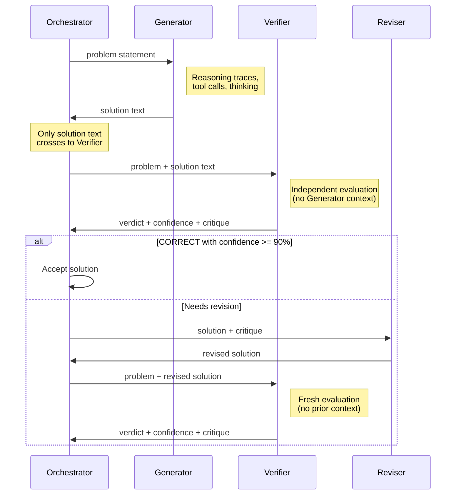
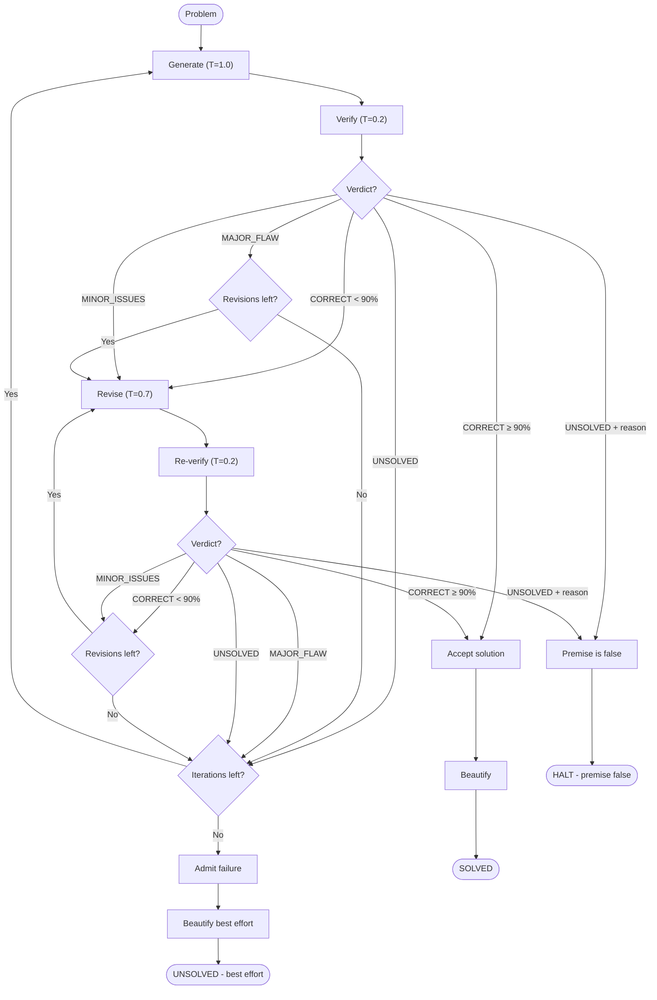

# Alethic

A mathematical reasoning agent inspired by [Google DeepMind's Aletheia](https://arxiv.org/abs/2602.10177), built on **Claude (Opus 4.6)**. Alethic implements a Generate-Verify-Revise loop with decoupled verification — the core architectural insight from DeepMind's design — to produce rigorous mathematical proofs and solutions with high confidence.

Available as a **Claude Code `/solve` skill** (recommended) or as a standalone **Python library** with CLI.

## Background and Motivation

In February 2026, Google DeepMind introduced Aletheia, a multi-agent system that achieved 95% accuracy on IMO-ProofBench Advanced and autonomously resolved open Erdős conjectures. The system's central innovation lies in its separation of solution generation from solution verification: by preventing the verifier from observing the generator's intermediate reasoning traces, Aletheia avoids the confidence inflation that arises when a model evaluates its own chain of thought. When a verifier has access to the generator's internal reasoning, it tends to follow the same logical path and confirm flawed steps with unwarranted certainty. Decoupling forces the verifier to reconstruct and independently assess each argument from the final output alone.

Alethic translates this architecture to Claude's API. The project implements the same three-subagent loop — Generator, Verifier, and Reviser — with each role instantiated as an independent API call (in the Python library) or a separate Task sub-agent with a fresh context window (in the Claude Code skill). The result is a system that can solve mathematical problems with verified confidence, or honestly admit failure when it cannot.

### Key References

- T. Shoeybi et al., "Towards Autonomous Mathematics Research," [arXiv:2602.10177](https://arxiv.org/abs/2602.10177) (Feb 2026). The primary Aletheia paper describing the Generate-Verify-Revise architecture.
- J. Huang et al., "Accelerating Scientific Research with Gemini," [arXiv:2602.03837](https://arxiv.org/abs/2602.03837) (Feb 2026). Companion paper on Gemini's scientific reasoning capabilities.
- R. Anil et al., "Semi-Autonomous Mathematics Discovery," [arXiv:2601.22401](https://arxiv.org/abs/2601.22401) (Jan 2026). The Erdős conjecture study demonstrating autonomous mathematical discovery.

## Architecture

Alethic's reasoning loop proceeds through three distinct phases that repeat until the solution is verified or the iteration budget is exhausted.

```
┌─────────────────────────────────────────────────────────┐
│                    Orchestrator Loop                     │
│                                                         │
│   ┌───────────┐    ┌──────────┐    ┌──────────┐       │
│   │ Generator  │───▶│ Verifier │───▶│ Reviser  │──┐    │
│   │  (T=1.0)  │    │  (T=0.2) │    │  (T=0.7) │  │    │
│   └───────────┘    └──────────┘    └──────────┘  │    │
│        ▲                                          │    │
│        └──────────────────────────────────────────┘    │
│                                                         │
│   Terminates when: CORRECT verdict (≥90%) OR max iters  │
└─────────────────────────────────────────────────────────┘
```

The **Generator** produces a candidate solution at high temperature (T=1.0) to encourage creative exploration of proof strategies. The **Verifier** then evaluates that solution at low temperature (T=0.2) for strict, deterministic assessment. Critically, the Verifier receives only the problem statement and the final written solution — never the Generator's thinking traces, tool outputs, or intermediate reasoning. If the Verifier identifies issues, the **Reviser** receives both the solution and the Verifier's structured critique, producing an improved version at moderate temperature (T=0.7) that balances faithfulness to the original with the flexibility to restructure flawed arguments.

The loop terminates under one of three conditions: the Verifier issues a `CORRECT` verdict with confidence at or above 90%, the maximum number of iterations is reached (strategic failure admission), or the Verifier detects that the problem's premise is false and halts early with an explanation.

### Information Flow and Decoupling

The following sequence diagram illustrates the critical decoupling boundary. The Generator's internal reasoning — thinking traces, tool call results, intermediate drafts — never crosses to the Verifier. Only the final solution text is passed, forcing the Verifier to evaluate the argument on its own merits.



### The Three Subagents

Each subagent is instantiated as an independent Claude API call with role-specific system prompts, temperature settings, and tool access. This separation ensures that no subagent can observe another's internal state.

**Generator.** The Generator's task is to produce a complete, self-contained mathematical solution. Its system prompt instructs it to restate the problem, select a proof strategy explicitly, justify every inference, and use precise mathematical notation. When balanced prompting is enabled (the default), an addendum directs the Generator to first explore whether the statement might be false by testing small cases, boundary conditions, and degenerate inputs before committing to a proof strategy. This anti-confirmation-bias technique, drawn directly from the Aletheia design, prevents the model from anchoring prematurely on a flawed approach. The Generator has access to a sandboxed Python environment for computational verification of intermediate results.

**Verifier.** The Verifier is the architectural cornerstone of the system. Its system prompt establishes strict independence: it must evaluate the solution purely on its written merits, checking every logical step, re-deriving computations independently, and flagging common mathematical errors including sign mistakes, off-by-one errors, vacuous truth claims, circular reasoning, non-exhaustive case analysis, and incorrect theorem application. The Verifier produces a structured output containing a verdict (`correct`, `minor_issues`, `major_flaw`, or `unsolved`), a numerical confidence score calibrated against explicit benchmarks (0.95-1.0 for fully verified solutions, below 0.50 for likely errors), a step-by-step critique, a reason field for false-premise detection, and a list of specific issues. The confidence threshold of 90% means that even a `correct` verdict at lower confidence is treated as requiring revision — the Verifier must be genuinely certain.

**Reviser.** When the Verifier identifies issues, the Reviser receives the original solution alongside the full structured critique. Its prompt instructs it to distinguish between minor issues (which can be patched in place) and major flaws (which require a fundamentally different proof strategy). The Reviser preserves parts of the solution that the Verifier confirmed as sound and provides explicit justification for each change. If it believes the critique itself is incorrect, it may argue back with evidence — but the subsequent re-verification by a fresh Verifier instance has the final word.

### Verdict Types and Actions

| Verdict | Condition | Action |
|---------|-----------|--------|
| `CORRECT` | Confidence ≥ 90% | Accept the solution and return it to the user |
| `CORRECT` | Confidence < 90% | Treat as uncertain — send to Reviser for strengthening |
| `MINOR_ISSUES` | — | Send to Reviser with the critique |
| `MAJOR_FLAW` | — | Revise if attempts remain, otherwise restart from Generator |
| `UNSOLVED` | Reason field populated | Problem premise is false — halt and explain |
| `UNSOLVED` | No reason | Cannot solve — restart from Generator or admit failure |

### Decision Flowchart

The full control flow, including revision loops, iteration restarts, and termination conditions:



### Verifier Output Format

The Verifier produces structured output that is parsed via regex with independent extraction per field. This design ensures that partial or malformed output still yields usable information — if the verdict is parseable but the confidence is not, the system defaults to 0.5 rather than failing entirely.

```
VERDICT: correct | minor_issues | major_flaw | unsolved
CONFIDENCE: 0.0 to 1.0

CRITIQUE:
[Step-by-step evaluation of the solution]

REASON: [Why the premise is false, or "N/A"]

ISSUES:
- [Issue 1]
- [Issue 2]
```

## Design Principles

**Decoupled verification.** The separation of Generator and Verifier contexts is the single most important architectural decision. In the Python library, decoupling is enforced at the API level: the `verify()` function receives only the problem string and the solution text, never the Generator's response object or thinking blocks. In the Claude Code skill, decoupling is enforced structurally — each Verifier runs as a separate Task sub-agent that launches with a fresh context window and physically cannot access the Generator's reasoning.

**Balanced prompting.** Before committing to a proof strategy, the Generator is instructed to actively search for counterexamples. This technique, adapted from the Aletheia paper, counteracts the confirmation bias that arises when a language model generates a solution: once a model begins pursuing a particular approach, it tends to rationalize intermediate steps rather than question the approach itself. By forcing an explicit counterexample search, the Generator is more likely to discover when a statement is false or when a different proof strategy would be more appropriate.

**Strategic failure admission.** When the Verifier cannot approve any solution after exhausting the iteration budget, the system returns `Verdict.UNSOLVED` along with the highest-confidence solution encountered during the run. This honest failure mode prevents the agent from hallucinating confidence in an unverified answer. The `admitted_failure` flag on the result object distinguishes between problems that were identified as having a false premise (a valid finding) and problems that the agent simply could not solve.

**Confidence calibration.** The Verifier's confidence score is calibrated against explicit benchmarks in the system prompt. A score of 0.95-1.0 indicates that every step has been verified and computationally confirmed. A score below 0.85 means the Verifier would not stake its professional reputation on the result. This calibration prevents the common failure mode where a model assigns high confidence to every output regardless of actual certainty.

**Sandboxed code execution.** Both the Generator and Verifier have access to a Python sandbox for computational verification. The sandbox restricts available builtins to a safe subset, limits importable modules to mathematical libraries (math, sympy, numpy, and related packages), and enforces execution timeouts via `SIGALRM`. This allows the subagents to test conjectures numerically, verify algebraic manipulations symbolically, and check edge cases computationally — all without the security risks of unrestricted code execution.

**File-based state (skill only).** In the Claude Code skill, all solutions, verifications, and revisions are written to files in a session directory (`/tmp/alethic-{timestamp}/`). The orchestrator tracks only summary metrics — verdict strings, confidence floats, and file paths — in its own context. This prevents the exponential context growth that would occur if full solution texts accumulated across iterations, enabling the system to run for many iterations without approaching context limits.

## Claude Code Skill (Recommended)

The `/solve` command runs Alethic natively inside Claude Code, using Task sub-agents for true architectural decoupling. Each Verifier launches as an independent Task with a fresh context window, providing the strongest possible guarantee that it cannot observe the Generator's reasoning process. The skill also includes a Beautifier stage that formats accepted solutions into clean LaTeX/Markdown for presentation.

### Install

#### Via marketplace (recommended)

```bash
claude plugins add hyperion-git/alethic
```

#### Manual installation

```bash
git clone https://github.com/hyperion-git/alethic.git
DEST=~/.claude/plugins/cache/local/alethic/0.2.0
mkdir -p "$DEST"
cp -r alethic/.claude-plugin alethic/skills "$DEST/"
```

Restart Claude Code. The `/solve` command is now available.

### Usage

```
/solve "Prove that sqrt(2) is irrational"

/solve -i 3 "Prove the AM-GM inequality for n variables"

/solve -i 5 -r 4 -b 80 "Prove the Fundamental Theorem of Algebra"
```

| Flag | Default | Description |
|------|---------|-------------|
| `-i` | 5 | Maximum generate-verify-revise iterations |
| `-r` | 3 | Maximum revision attempts per iteration |
| `-b` | 50 | Total sub-agent call budget |

### Skill Execution Flow

The skill orchestrator proceeds through four stages. First, the **Generator** (an Opus Task sub-agent) reads the problem file, uses Bash for Python computation and WebSearch for theorem lookup, and writes a complete solution to disk. Second, the **Verifier** (a separate Opus Task sub-agent with a fresh context) reads only the problem file and the solution file, performs its independent evaluation, and writes a structured verification report. If issues are found, the **Reviser** (another Opus Task sub-agent) reads the solution and the critique, writes a revised solution, and the cycle repeats with a fresh Verifier. Finally, the **Beautifier** formats the accepted solution into clean LaTeX/Markdown with proper mathematical typesetting. All intermediate state lives in `/tmp/alethic-{timestamp}/`, and the orchestrator tracks only verdicts and confidence scores in its own context window.

## Python Library

The Python library provides programmatic access for batch benchmarking, integration into larger pipelines, and fine-grained configuration of the reasoning loop. It requires an `ANTHROPIC_API_KEY` environment variable.

### Install

```bash
pip install -e ".[dev]"  # from source
```

### Quick Start

```python
from alethic import MathAgent, AgentConfig

agent = MathAgent()  # uses ANTHROPIC_API_KEY env var
result = agent.solve("Prove that the square root of 2 is irrational.")

print(result)            # Full formatted output
print(result.solved)     # True/False
print(result.confidence) # 0.0-1.0
```

### CLI

```bash
# Inline problem
alethic "Prove that there are infinitely many primes"

# From file
alethic --file problem.txt

# JSON output for pipeline integration
alethic --json "Solve x^2 - 5x + 6 = 0"

# Control iteration budget
alethic --iterations 3 "Prove the AM-GM inequality"

# Extended thinking (deeper reasoning, more tokens per call)
alethic --thinking --thinking-budget 20000 "Prove the Basel problem"

# Disable code execution (pure reasoning mode)
alethic --no-code "Prove Euler's identity"
```

### Configuration

The `AgentConfig` dataclass exposes all tunable parameters. Temperature settings follow the Aletheia design: high for creative generation, low for strict verification, moderate for targeted revision.

```python
config = AgentConfig(
    model="claude-opus-4-6",           # Anthropic model ID
    max_iterations=5,                   # Max generate-verify-revise cycles
    max_revisions_per_cycle=3,          # Max revisions before restarting
    enable_code_execution=True,         # Python sandbox for computation
    temperature_generator=1.0,          # Creative exploration
    temperature_verifier=0.2,           # Strict, deterministic evaluation
    temperature_reviser=0.7,            # Balanced revision
    max_tokens=16384,                   # Max tokens per API call
    extended_thinking=False,            # Enable extended thinking
    thinking_budget=10000,              # Token budget for thinking blocks
    verbose=True,                       # Print progress to stdout
)

agent = MathAgent(config=config)
```

### Extended Thinking

When `extended_thinking=True`, the API enables Claude's internal reasoning budget, allowing the model to "think longer" on difficult problems before producing output. The Aletheia paper attributes significant performance gains to Gemini's Deep Think mode, which scales inference-time compute for harder problems. Claude's extended thinking provides an analogous capability. Note that the API requires `temperature=1` when thinking is enabled, so the per-subagent temperature settings are overridden in this mode.

### Bundled Examples

The library includes six example problems spanning undergraduate to intermediate difficulty for quick testing and demonstration.

```bash
# List available examples
python -m alethic.examples --list

# Run a specific example
python -m alethic.examples --pick 1

# Run all examples with custom iteration limit
python -m alethic.examples --iterations 3
```

## Module Reference

The Python library is organized into six modules, each with a single clear responsibility.

| Module | Purpose |
|--------|---------|
| `agent.py` | `MathAgent` orchestrator — runs the full Generate-Verify-Revise loop with false-premise detection and strategic failure admission |
| `subagents.py` | `generate()`, `verify()`, `revise()` — each wraps a Claude API call with role-specific prompts, temperature, and tool configuration; includes the tool-use loop (up to 5 rounds) and structured output parsing |
| `models.py` | Dataclasses: `AgentConfig`, `Solution`, `VerificationResult`, `Revision`, `AgentResult`, and the `Verdict` enum |
| `prompts.py` | System and user prompt templates for all three subagents, plus the balanced prompting addendum |
| `tools.py` | `execute_python()` sandbox with restricted builtins and module allowlist, `PYTHON_TOOL` schema for the Anthropic API, and `process_tool_calls()` for the tool-use loop |
| `cli.py` | `argparse`-based CLI entry point (`alethic`) with `--thinking`, `--json`, and `--file` support |
| `examples.py` | Six bundled example problems (`python -m alethic.examples`) |

| Skill file | Purpose |
|------------|---------|
| `skills/solve/SKILL.md` | `/solve` command orchestrator — spawns Opus Task sub-agents with file-based state |
| `.claude-plugin/plugin.json` | Plugin metadata for Claude Code |
| `.claude-plugin/marketplace.json` | Marketplace manifest for `hyperion-git/alethic` |
| `skills/solve/references/*.md` | Standalone prompt references (generator, verifier, reviser, beautifier) |

## Project Structure

```
alethic/
├── .claude-plugin/                 # Claude Code marketplace plugin
│   ├── plugin.json                 # Plugin metadata (v0.2.0)
│   └── marketplace.json            # Marketplace manifest
├── skills/                         # Claude Code skills
│   └── solve/
│       ├── SKILL.md                # /solve command orchestrator
│       └── references/             # Standalone prompt references
│           ├── generator.md
│           ├── verifier.md
│           ├── reviser.md
│           └── beautifier.md
├── src/alethic/                    # Python library
│   ├── agent.py                    # MathAgent orchestrator
│   ├── subagents.py                # generate(), verify(), revise()
│   ├── models.py                   # Data models + Verdict enum
│   ├── prompts.py                  # System/user prompt templates
│   ├── tools.py                    # Python sandbox + tool-use loop
│   ├── cli.py                      # CLI entry point
│   └── examples.py                 # Bundled example problems
└── tests/
    └── test_alethic.py             # 34 tests (mocked API)
```

## Testing

All tests use mocked API responses and require no API key. The test suite covers data models, prompt content validation, sandbox execution (including timeout enforcement and import restrictions), structured output parsing for all verdict types, CLI argument parsing, and end-to-end integration flows for solved, revised, and failed problems.

```bash
# Run all 34 tests
pytest

# With coverage report
pytest --cov=alethic

# Lint and format
ruff check src tests
ruff format src tests
```

## Known Limitations

**Single-model verification.** Both the Generator and Verifier use the same underlying model (Claude Opus). While decoupling prevents the Verifier from following the Generator's specific reasoning path, both models share the same training data and potential blind spots. The Aletheia paper uses the same single-model approach (Gemini for all roles) and notes that decoupling alone provides substantial gains, but cross-model verification could further improve robustness.

**No best-of-N sampling.** Each iteration generates a single candidate solution. The Aletheia system benefits from sampling multiple candidates in parallel and selecting the best. The Python library could be extended with parallel generation; the skill architecture does not currently support this.

**Temperature override with extended thinking.** The Anthropic API requires `temperature=1` when extended thinking is enabled, which overrides the carefully tuned per-subagent temperatures. In this mode, the Verifier loses its low-temperature strictness, potentially reducing verification precision. The prompt instructions partially compensate for this by emphasizing skepticism and rigor.

**Skill temperature limitations.** Claude Code Task sub-agents run at the default temperature. The per-subagent temperature tuning (T=1.0, T=0.2, T=0.7) is only available through the Python library. The skill relies on prompt instructions to approximate these behavioral differences.

**Context accumulation in skill mode.** Without `context:fork`, all Task call/response pairs accumulate in the main conversation. The file-based state design mitigates this by keeping solution text out of the orchestrator's context, but very long runs (8+ iterations) may approach context limits.

**Beautifier runs post-verification.** The Beautifier formats the accepted solution after the final verification pass. While it is constrained to formatting-only changes (converting text math to LaTeX, adding section headers), there is no re-verification of the beautified output. The raw verified solution is preserved at `best_solution.md` as a fallback.

**Session cleanup.** Session directories in `/tmp/alethic-*` persist until the system clears `/tmp/`, typically on reboot. For manual cleanup: `rm -rf /tmp/alethic-*`.

## License

MIT
